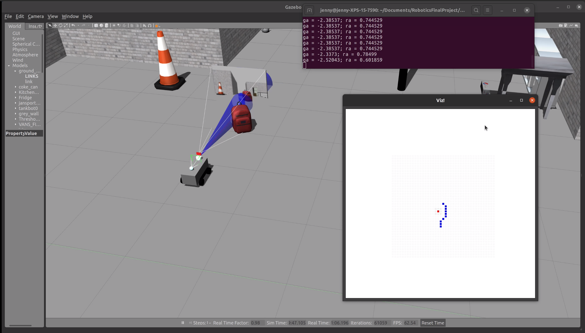

# Map Coloring
Map coloring is useful for labling locations on the occupancy map. This tool can be used to color the spots red, ogange, brown, blue, yellow, or green. The hit points of the spot will be increased as so the robot will also not run into objects.

# To use
1. clone repo into `/brain` and add `.cc` to your MakeFile
2. copy modifications in grid.cc/.hh in the following functions:
   1. grid_view
   2. stringToInt
   3. stringToInt
3. calling functions in brain.cc
since the mbot ranger sensor point in front we use 0 for the angle:

```
grid_apply_hit_color(robot->range, 0, pose, "red");
```

then when calling:
```    
Mat view = grid_view(pose, path);
viz_show(view);

```

the viz show output will have colored spots where grid_apply_hit_color was applied

4. make sure you have these includes in `brain.cc`:
```
#include "grid.hh"
#include "viz.hh"
```


### Base Code:
Builds on starter code hw7 occupancy grid:  https://github.com/NatTuck/cs5335hw-gazebo

This is the same robot model as ranger bot therefore this can be used in simulating the mbot ranger. 
